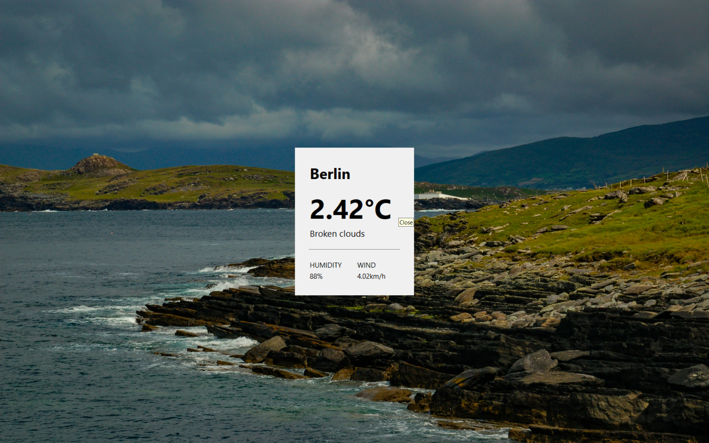
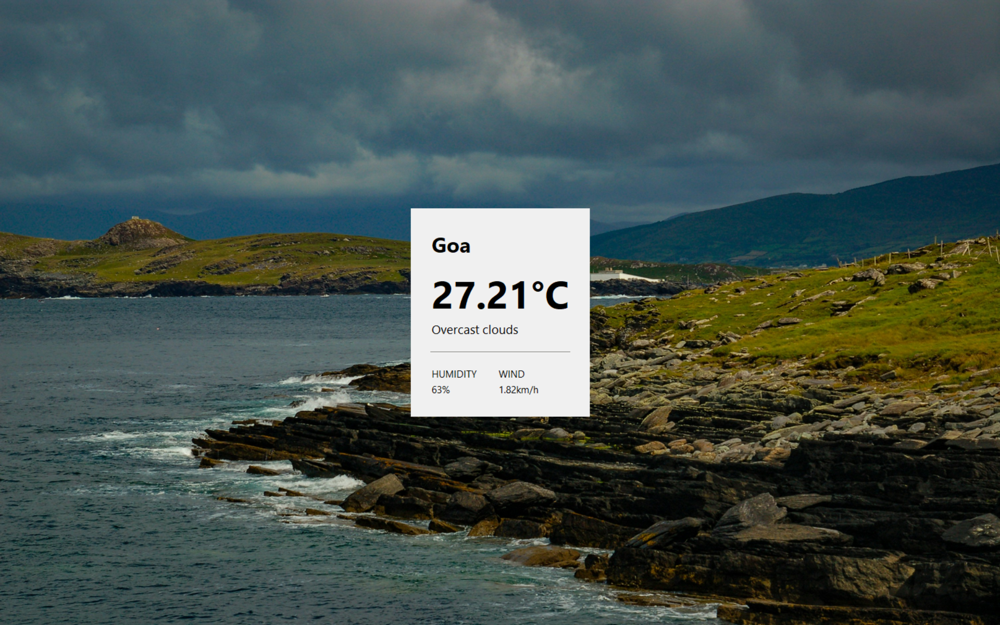

Dynamic Weather Information System
A software project developed entirely in Python, engineered to provide users with immediate, real-time weather readings. The application's core functionality involves connecting to a third-party API to access essential metrics like humidity, wind speed, and temperature, which are then promptly rendered upon a city name submission.
Performance & Features
Input Mechanism: Accepts a city name directly from the user.
API Integration: Uses the WeatherAPI to fetch the current atmospheric data for the specified location.
Information Output: Clearly visualizes data points such as current weather condition, temperature, wind velocity, and relative humidity.
Interface: Features a user-friendly and streamlined GUI constructed with Tkinter.
Speed: Optimized handling for rapid API calls and response display.
Technologies Utilized
Python
Tkinter (GUI Framework)
WeatherAPI (Data Provider)
Requests library
User enters the name of a city
App sends a request to the weather API
API returns the latest weather details
App displays all information neatly on the screen
Screenshot
-----------------------------------------

